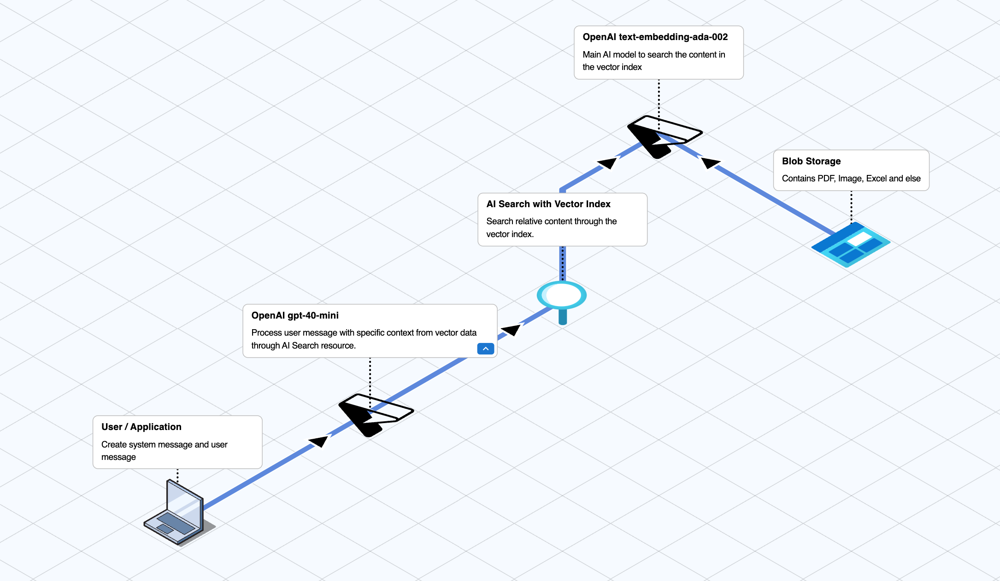

## What is Retrieval-Augmented Generation (RAG)?

Retrieval-Augmented Generation (RAG) is a technique that combines the strengths of information retrieval and natural language generation. It involves retrieving relevant documents or data from a large corpus and using this information to generate more accurate and contextually relevant responses. This approach enhances the capabilities of AI models by providing them with access to a vast amount of external knowledge, leading to more informed and precise outputs.

## Prerequisites

1. [.NET SDK 7.0](https://dotnet.microsoft.com/download/dotnet/7.0) or later
2. [Azure Subscription](https://azure.microsoft.com/en-us/free/)
3. [Azure OpenAI Service](https://azure.microsoft.com/en-us/services/cognitive-services/openai-service/)

## Azure Resource Setup


This diagram represents an Azure-based architecture for implementing Retrieval-Augmented Generation (RAG) with AI models. Here's the explanation of the relationships in the context of the Azure ecosystem:

### User/Application:

This is the entry point where users interact with the system. The users send their queries or requests via an application interface.
OpenAI GPT-4 or GPT-4-turbo:

This component processes user messages and generates contextually relevant queries or responses.
The user queries are enriched or transformed into a format suitable for the search process.

### AI Search with Vector Index:

This searches through a vector index created by Azure's Cognitive Search or other AI tools.
Vector embeddings, representing the contents of documents, are queried to retrieve the most relevant documents from the indexed data.

### Azure Blob Storage:

This serves as the primary storage for various types of files like PDFs, images, Excel files, and other documents.
It contains the data corpus used by the vector search engine.
Azure OpenAI Embedding Model (text-embedding-ada-002):

This model generates vector embeddings for the documents in the blob storage.
The embeddings are used to create a vector index for efficient and context-aware searches.

### Workflow:
1. User Input: A user sends a query or message.
2. GPT-4 Processing: The query is pre-processed by the GPT model, ensuring it is tailored for retrieval.
3. Search Query: The query is directed to the AI Search with Vector Index to find semantically relevant content.
4. Vector Search: Using vector embeddings, the search system identifies relevant documents stored in the Blob Storage.
5. Response: The retrieved content is processed and used by GPT-4 to generate a detailed and accurate response, sent back to the user.

### Azure Key Relationships:
- Blob Storage and Embedding Model: Data in Blob Storage is transformed into vector embeddings using the embedding model, making it searchable.
- AI Search and GPT-4: AI Search acts as a backend to GPT-4, supplying it with relevant data for improved responses.
- User and Azure AI: Users interact with an intelligent system that combines Azure's storage, search, and AI capabilities.

### Setup Resource Steps
1. **Create Azure OpenAI Resource**:
    - Go to the Azure portal and create a new resource in the `East US` region with the `gpt-4o-mini` model, which supports both text and image input at the lowest price.
    - On the Azure OpenAI page, create a new resource with the following details:
        - **Subscription**: Your subscription group
        - **Resource group**: The resource group name from step 1
        - **Name**: New resource name
        - **Pricing tier**: Standard S0

2. **Create Storage Account**:
    - Open the Storage accounts page and create a new resource with the following details:
        - **Subscription**: Your subscription group
        - **Resource group**: The resource group name from step 1
        - **Storage account name**: New account name
        - **Region**: East US
        - **Primary service**: Azure Blob Storage or Azure Data Lake Storage Gen 2
        - **Performance**: Standard
        - **Redundancy**: Locally-redundant storage (LRS)

3. **Setup Storage Container**:
    - Go to the new storage account page, then navigate to Data storage > Containers.
    - Create a new container.
    - Enter the new container and upload the data source from [this link](https://raw.githubusercontent.com/MicrosoftLearning/mslearn-openai/refs/heads/main/Labfiles/06-use-own-data/data/brochures.zip). These files contain travel brochures that will be vectorized as embedded data for AI.

4. **Create Azure Cognitive Search Resource**:
    - Open the AI Search page and create a new resource with the following details:
        - **Resource Group**: The resource group name from step 1
        - **Service name**: New service name
        - **Location**: East US
        - **Pricing Tier**: Free

5. **Configure Azure Cognitive Search**:
    - Go to the new AI Search resource and click on `Import and vectorize data`.
    - Select `Azure Blob Storage` on the `Set up your data connect` page.
    - Configure your Azure Blob Storage with the following details:
        - **Subscription**: Your subscription group
        - **Storage account**: The storage account from step 2
        - **Blob container**: The blob container from step 3
        - **Blob folder**: Leave it empty
        - **Parsing mode**: Default
        - **Enable deletion tracking**: Uncheck
        - **Authenticate using managed identity**: Uncheck
    - Click `Next` to proceed to the `Vectorize your text` step and fill in the following details:
        - **Kind**: Azure OpenAI
        - **Subscription**: Your subscription group
        - **Azure OpenAI service**: The OpenAI resource from step 1
        - **Model deployment**: Select `text-embedding-ada-002` (Deploy this model through Azure Foundry Service if not available)
        - Check the acknowledgment box for additional costs.
    - Click `Next` on the `Vectorize and enrich your images` step (no changes needed).
    - Click `Next` on the `Advance settings` step (no changes needed).
    - Click `Next` on the `Review and create` step to create the vector index.

6. **Deploy and Configure OpenAI Model**:
    - Go back to the OpenAI resource from step 1 and click `Go to Azure AI Foundry portal`.
    - Deploy `gpt-4o-mini` with `Global Standard` and set the rate limit to 16K tokens per minute.
    - Copy the `KEY1` and `Endpoint` from Resource Management > Keys and Endpoint, then paste them into `AzureOAIKey` and `AzureOAIEndpoint` in `appsettings.json`.
    - Copy the AI model deployment name and paste it into `AzureOAIDeploymentName` in `appsettings.json`.

7. **Configure Azure Cognitive Search in appsettings.json**:
    - Go to the AI Search resource from step 4.
    - Copy the `Url` from the `Overview` page and paste it into `AzureSearchEndpoint` in `appsettings.json`.
    - Go to `Settings` > `Keys`, then copy the `Primary admin key` and paste it into `AzureSearchKey` in `appsettings.json`.
    - Go to `Search management` > `Indexes`, then copy the `vector-xxx` name and paste it into `AzureSearchIndex` in `appsettings.json`.


## Setup

1. Clone the repository:
    ```sh
    git clone git@github.com:xsodus/azure-rag-ai-template.git
    cd azure-rag-ai-template
    ```

2. Restore the dependencies:
    ```sh
    dotnet restore
    ```

## Running the Project

1. Build the project:
    ```sh
    dotnet build
    ```

2. Run the project:
    ```sh
    dotnet run
    ```

## Overview

The `RAGAI.cs`file is part of a project that uses Azure OpenAI and Azure Cognitive Search to implement a Retrieval-Augmented Generation (RAG) system. This system processes user queries, retrieves relevant information from a data source, and generates contextually relevant responses.

### Code Explanation

#### 1. Configuration

The application reads configuration settings from 

appsettings.json

using `Microsoft.Extensions.Configuration`. This includes settings for Azure OpenAI and Azure Cognitive Search.

#### 2. Initialize Azure OpenAI Client

An `OpenAIClient` is initialized with the Azure OpenAI endpoint and key. This client is used to interact with the Azure OpenAI service.

#### 3. Configure Data Source

An `AzureSearchChatExtensionConfiguration` object is created to configure the Azure Cognitive Search data source. This configuration is used to retrieve relevant documents from the data source.

#### 4. Create Chat Message with Image Content

A `ChatMessageImageContentItem` is created with an image URL. This object represents an image that will be used as input for the OpenAI model.

```csharp
ChatMessageImageContentItem imageContentItem = new ChatMessageImageContentItem(
    new Uri("https://upload.wikimedia.org/wikipedia/commons/8/85/Clock_Tower_-_Palace_of_Westminster%2C_London_-_May_2007_icon.png"),
    ChatMessageImageDetailLevel.Low
);
```

#### 5. Create System Message

A `ChatRequestSystemMessage` is created to set up the role and expected result format. This message defines the role of the AI model and specifies the format of the response.

```csharp
ChatRequestSystemMessage systemMessage = new ChatRequestSystemMessage(
    "You're travel agent assistant who can build the travel plan and optimize the budget for the customer. I need you to return the result as JSON data below:" +
    "{\"place_name\":\"<place_name>\", \"place_description\":\"<place_description>\"}"
);
```

#### 6. Ask the Model About the Place in the Image

A `ChatCompletionsOptions` object is created with the system message and user message asking about the place in the image. The `GetChatCompletions` method is called on the `OpenAIClient` to get the response from the model.

```csharp
ChatCompletionsOptions chatCompletionsOptions = new ChatCompletionsOptions()
{
    Messages =
    {
        systemMessage,
        new ChatRequestUserMessage(
            new ChatMessageTextContentItem("What is this place in the image?"),
            imageContentItem
        )
    },
    Temperature = 0.2f,
    DeploymentName = oaiDeploymentName
};

ChatCompletionsResponse response = openAIClient.GetChatCompletions(chatOptions);
```

#### 7. Process Response

The response is deserialized from JSON to a dictionary. A new question is generated based on the response.

```csharp
var responseData = JsonConvert.DeserializeObject<Dictionary<string, string>>(response.Choices[0].Message.Content);
string placeName = responseData["place_name"];
string newQuestion = $"Tell me about hotels near {placeName}.";
```

#### 8. Ask About Hotels Near the Place

A new `ChatCompletionsOptions` object is created with the new question and the RAG data source configuration. The `GetChatCompletions` method is called again to get the final response.

```csharp
ChatCompletionsOptions chatCompletionsOptions = new ChatCompletionsOptions()
{
    Messages =
    {
        systemMessage,
        new ChatRequestUserMessage(nextQuestion)
    },
    Temperature = 0.2f,
    DeploymentName = oaiDeploymentName,
    // Embed a vector data source (RAG)
    AzureExtensionsOptions = new AzureChatExtensionsOptions()
    {
        Extensions = {ownDataConfig}
    }
};

ChatCompletionsResponse finalResponse = openAIClient.GetChatCompletions(newChatOptions);
```

#### 9. Print Response

The final response is printed to the console. If citations are enabled, the citations are also printed.

```csharp
Console.WriteLine(finalResponse.Choices[0].Message.Content);

if (finalResponse.Citations != null)
{
    foreach (var citation in finalResponse.Citations)
    {
        Console.WriteLine($"Citation: {citation.Source}");
    }
}
```


